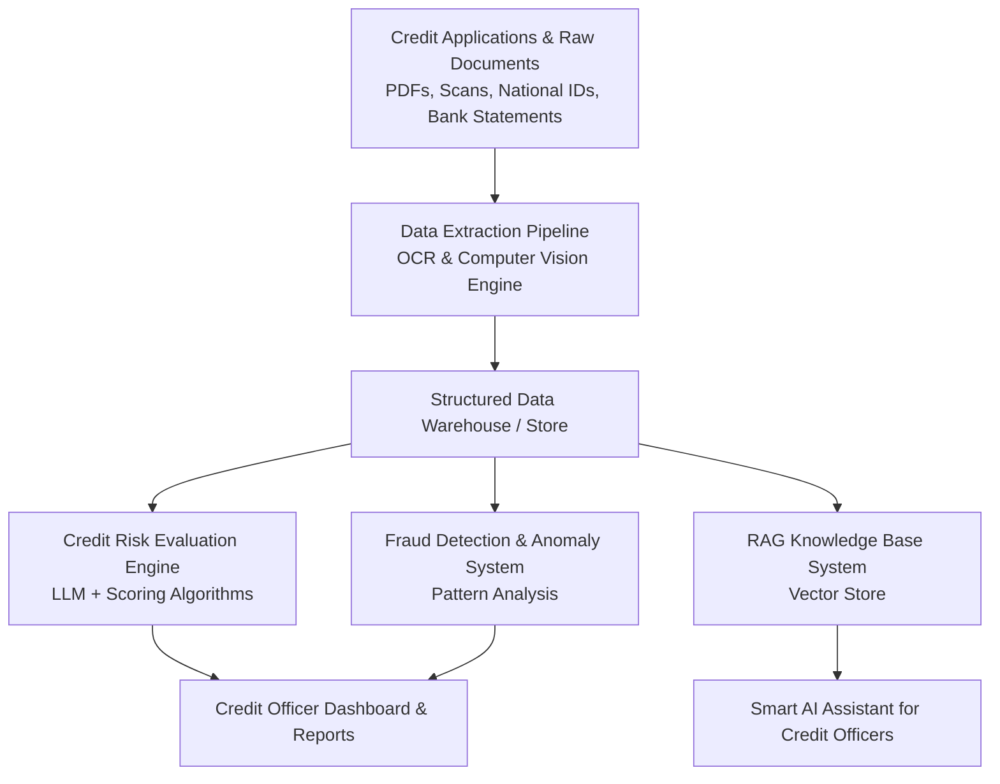

# CrediX - Smart Financing & Credit Application Analysis Platform

[]()
[]()
[]()

---

## 📋 Executive Summary

**CrediX** is an end-to-end AI-powered platform engineered to revolutionize credit application assessment, risk evaluation, and fraud detection within the Egyptian financial and banking sector. By leveraging modern Artificial Intelligence technologies—such as Optical Character Recognition (OCR), Computer Vision, Large Language Models (LLMs), and Retrieval-Augmented Generation (RAG)—CrediX automates document data extraction, credit risk scoring, fraud indicator detection, and provides an intelligent decision-support assistant for credit officers.

The platform addresses core operational bottlenecks caused by manual document review, significantly reducing decision-making latency, enhancing credit scoring precision, and mitigating fraud risks in strict compliance with Central Bank of Egypt (CBE) regulations and data privacy standards.

---

## 🎯 Key Objectives & KPIs

### Business Objectives
* ⏱ **Approval Speed**: Reduce average financing approval processing time by **30%** within 6 months of pilot launch.
* 📉 **Fraud Mitigation**: Decrease financial losses resulting from credit fraud by **15%** within the first year of operation.
* 📈 **Processing Capacity**: Increase daily processed applications by **40%** (target capacity: 1,000 applications/day) without increasing staffing overhead.
* 😊 **Customer Experience**: Enhance borrower satisfaction scores by **20%** through faster turnarounds.

### Technical Target KPIs
* 📄 **Document Data Extraction (OCR & Vision)**: Achieve $\ge 95\%$ accuracy on text and field extraction from financial documents, bank statements, and IDs.
* 📊 **Credit Evaluation & Fraud Models**: Achieve $\ge 90\%$ accuracy in creditworthiness classification and fraud risk detection.
* 💬 **AI Assistant (RAG Engine)**: Successfully answer $\ge 80\%$ of credit officers' automated queries accurately.

---

## 🏗 Platform Architecture & Features



### Core Modules
1. **Automated Document Extraction (OCR & Computer Vision)**:
   - Automated text and field extraction from diverse financial and identity documents (bank statements, commercial registers, tax cards, national IDs).
2. **AI Credit Risk Scoring (LLM Powered)**:
   - Analyzes extracted financial metrics, income statements, and applicant profile data to compute comprehensive creditworthiness scores and risk assessments.
3. **Fraud Indicator & Anomaly Detection**:
   - Identifies suspicious behavioral patterns, inconsistencies across documents, and potential fraud indicators to protect against credit losses.
4. **Intelligent Credit Assistant (RAG Engine)**:
   - Interactive AI assistant allowing credit officers to query application data, credit policies, and risk summaries using natural language.

---

## 🌿 Git Branching Strategy

To support multi-developer collaboration across the 5 specialized technical roles, the project follows this branching workflow:

### Branch Structure

* `main`: Production-ready, stable releases.
* `develop`: Primary integration branch.
* `feature/*`: Dedicated branches for role-specific features and modules.

```text
main
 └── develop
      ├── feature/ocr-vision-pipeline       (Data & OCR-Vision Engineer)
      ├── feature/credit-eval-fraud-models  (LLM & RAG Engineer)
      ├── feature/rag-ai-assistant          (LLM & RAG Engineer)
      ├── feature/mlops-cicd-integration    (Integration, MLOps & QA Engineer)
      ├── feature/business-rules-specs      (Business & Data Analyst)
      └── docs/architecture-and-handbook    (AI Product Lead)
```

### Initial Git Commands to Create Branches

```bash
# Switch to integration branch
git checkout -b develop

# Create feature branches for project roles
git branch feature/ocr-vision-pipeline
git branch feature/credit-eval-fraud-models
git branch feature/rag-ai-assistant
git branch feature/mlops-cicd-integration
git branch feature/business-rules-specs
git branch docs/architecture-and-handbook
```

---

## 👥 Team Roles & Responsibilities (RACI Matrix)

| Role | Core Responsibilities | Key Deliverables |
| :--- | :--- | :--- |
| **AI Product & Delivery Lead** | Overall project delivery, sprint planning, team leadership, stakeholder communication, roadmap enforcement. | Project Charter, Timeline, Project Handbook, Final Presentation |
| **Business & Data Analyst** | Banking domain requirements, business rules, data dictionary, BRD definition, gap analysis. | Business Requirements Document (BRD), Business Rules Engine Specs |
| **Data & OCR-Vision Engineer** | Document processing pipelines, OCR engine development, Computer Vision models, data quality assurance. | Data Extraction Pipeline, Processed & Cleaned Datasets |
| **LLM & RAG Engineer** | Credit evaluation LLMs, fraud detection models, RAG vector store implementation, prompt engineering. | Credit Risk Models, Fraud Detection Engine, RAG Assistant API |
| **Integration, MLOps & QA Engineer** | System integration, CI/CD pipelines, MLOps workflow, API deployment, QA & security monitoring. | Model APIs, MLOps Pipelines, Test Reports, Technical Documentation |

---

## 🗓 8-Week Implementation Roadmap

* **Week 1: Project Setup & Requirement Analysis**: Problem definition, environment setup, initial MVP scope, starting initial research.
* **Week 2: Data Analysis & System Architecture**: Architecture design, dataset identification, security compliance, model requirements definition.
* **Week 3: OCR & Computer Vision Pipeline**: Building initial document text & table extraction pipeline, sample testing.
* **Week 4: Credit Evaluation & Fraud Detection Models**: Model development, initial model training, scoring logic implementation.
* **Week 5: RAG Assistant & System Integration**: RAG architecture, LLM integration, initial UI dashboard prototype, pipeline connection.
* **Week 6: Optimization & End-to-End Testing**: Model performance fine-tuning, system integration testing, bug fixing, QA validation.
* **Week 7: Technical Documentation & Presentation**: Technical documentation, credit officer user manual, final presentation setup.
* **Week 8: Demo Day & Final Project Handover**: Live platform demonstration, stakeholder evaluation, project retrospective, final code handover.

---

## 🛠 Tech Stack

* **Programming Language**: Python 3.10+
* **Document Processing & Vision**: OpenCV, Tesseract OCR, PyTorch / TensorFlow
* **LLM & RAG Frameworks**: HuggingFace Transformers, LangChain / LlamaIndex, Vector Databases (ChromaDB / Qdrant / FAISS)
* **Integration & MLOps**: FastAPI / Flask, Docker, GitHub Actions (CI/CD), MLflow
* **Documentation & Diagramming**: Markdown, Mermaid.js, Git

---

## 🚀 Getting Started

1. **Clone the Repository**:
   ```bash
   git clone https://github.com/your-org/CrediX.git
   cd CrediX
   ```

2. **Set Up Python Virtual Environment**:
   ```bash
   python3 -m venv venv
   source venv/bin/activate
   ```

3. **Install Dependencies**:
   ```bash
   pip install -r requirements.txt
   ```

---

*CrediX Project - AI-Powered Credit Application & Risk Analysis Platform*
